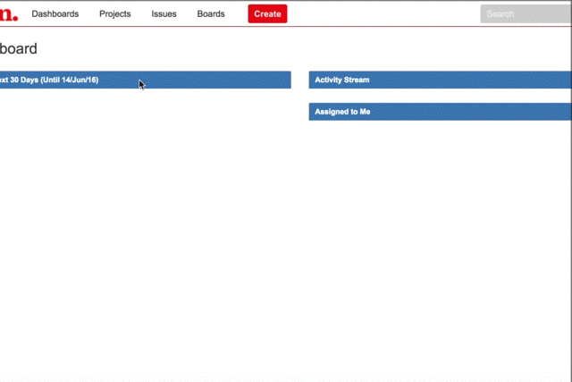
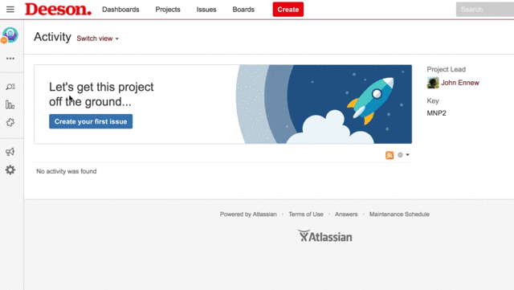
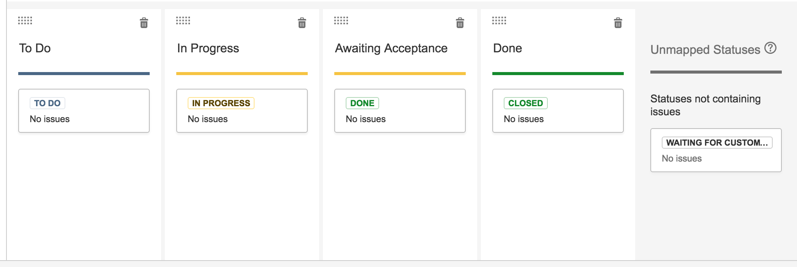
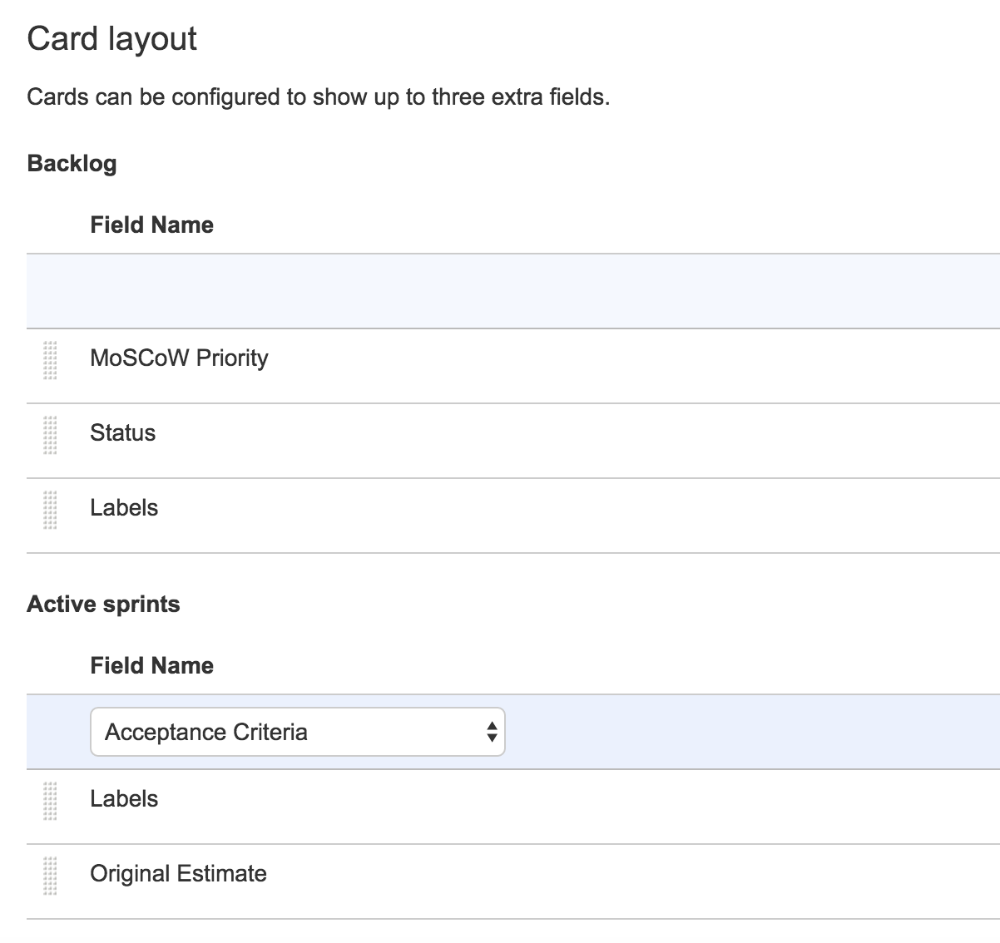

This page describes how we use Jira at Deeson.

## Creating a project

1. Click the projects drop down
2. Click *Create project*
3. Click *Create with shared configuration*
4. Choose the *Deeson Template project* to copy the configuration from
5. Set the name and project key

## Configure project details

1. Go into the project and click the cog in the toolbar on the left
of the screen
2. Click *Project details*
3. Set the category to specify the _pod_ which owns this project
4. Make sure you set an avatar for easy project identification!

## Creating a board

A project can have 1 or more boards which are used to organise the
tasks.

In the simple case, you will have a single board on the project
which contains all the issues in the project.

In the more complex case, you can separate the issues onto different
project boards. This is useful, for example, if you have several
concurrent projects for the same client or need to manage both a
project as well as ongoing maintenance work to the live site.

### Creating a simple board

1. From the Project Board menu (*...* button) choose *Create board*
2. Choose to create a *Scrum board* if this is a project with  sprints or *Kanban* board for an adhoc support project
3. Choose *Board from an existing project*
4. Give the board a name, e.g. *Project board*

### Recommended board settings

To configure a board, navigate to the project then choose *Board* and *Configure*

#### Columns
 
Add an _Awaiting acceptance_ column and move the statues to match the setup below

#### Swimlanes

Base Swimlanes on _Stories_

#### Card layout

Set additional fields on the layout of story cards as below

#### Estimation 

1. Estimation statistic should be *Original time estimate*
2. Time tracking should be *Remaining Estimate and Time Spent*

#### Issue detail view

Add *Acceptance criteria* field to the _General Fields_