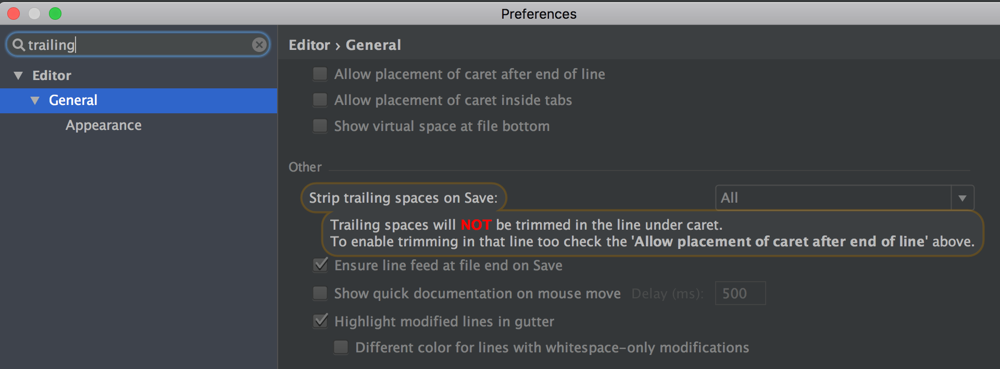
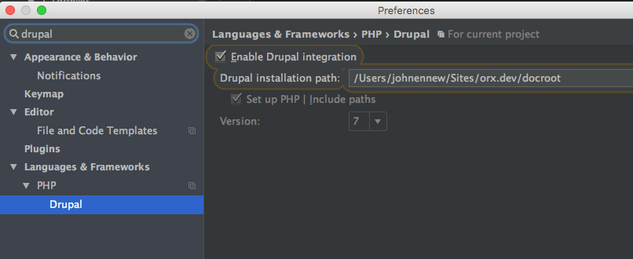

Ensure you have the following configuration in PHP Storm

### Trailing spaces

Editor > General > Strip trailing spaces on Save: All

Ensure line feed at file end on Save: Checked

### Drupal configuration

On a per project basis, if this is a Drupal project you should tell PHP Storm that.

Languages & Frameworks > PHP > Drupal > Enable Drupal integration

Specify the path to Drupal docroot and specify the Drupal Version as well.

