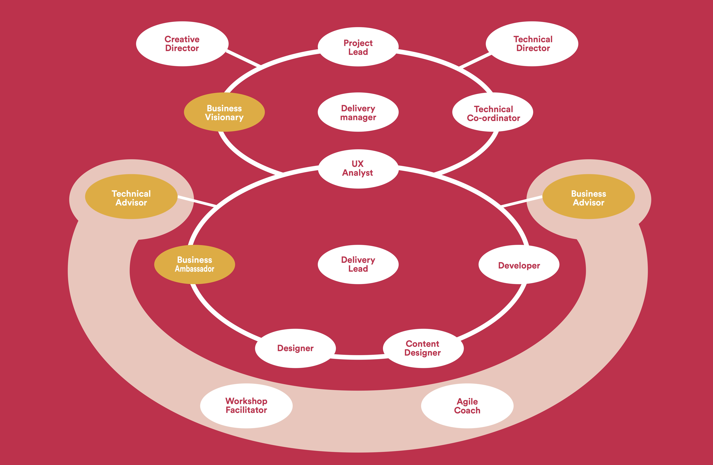

# Roles at Deeson

This page describes the roles individuals take on at Deeson.

First up, some definitions before reading this page:

1. *Job roles* are the variety of functions an individual will play in either a project or company situation.
2. *Job titles* define a person’s position in the company and the one or more job roles for which they are expected to be expert in.

*Job roles* set expectations for the project, client and company and ensure someone is covering all the different aspects of what we do.

In some cases, individuals will perform more than one of the roles on a project. As an individual's responsibilities increase, they are likely to take on more roles. This allows individuals to grow and develop professionally by moving into new areas and working on new skills.

*Job titles* reflect the company baseline for an individual and what roles they are expected to excel at. They also represent milestones in a career as they define the roles an individual needs to work on to reach it.

## Shared accountabilities

Here are the specific accountabilities we all share regardless of our job title and role on any specific project:

* Client satisfaction
* Delivering projects (on time, on budget, on spec)
* Your own capacity
* Your own capability
* Supporting your colleagues
* Following company processes

## Project roles at Deeson

Our project management process is based on the Agile methodology called [DSDM Agile project framework](https://www.agilebusiness.org/content/introduction-0) developed by the Agile Business Consortium. Project roles are distinct sets of responsibilities on a project. An individual on a project may hold one or more of these roles.

The diagram below shows the DSDM 'alien baby' diagram that shows the various project roles.

The roles in the head are project governance roles, those in the body are the team that build and deliver the solution for the project. The roles in the shaded area are supporting the project and are not part of the project team. White roles are Deeson roles and orange roles are client or other external roles.

### Project Lead

The project lead acts as oversight on the entire project and is ultimately responsible for its successful delivery.

They ask the hard questions to keep the project team honest and the project on track. They discover the issues that the team struggle to articulate and act as the most senior escalation point on the project team for the client. They have the more senior account level conversations and consultancy with the client.

The project lead provides continuity of leadership and direction throughout the project, starting with Feasibility and staying with the project through Foundations, Development and Launch.

* Positively encouraging the sense of shared ownership in the project and its goals with the whole team.
* Holding project team members to account for project slippage.
* Identifying weaknesses in project team approach and identifying the root causes of the issues.
* Having the difficult client conversations if other routes have failed.
* Supporting and coaching the project team, in particular the Delivery Lead and Delivery Manager.
* Escalating performance issues to the Chapter Leads.

### Delivery Manager

The Delivery Manager is responsible for the successful delivery of the solution.

* Ensuring effective and timely communication with our clients, teams and other appropriate stakeholders
* Performing high-level project planning and scheduling (but not detailed Timebox planning or task planning)
* Collaborating with the Delivery Lead and other appropriate stakeholders to create and agree the Delivery Plan
* Monitoring progress against the Delivery Plan
* Managing risk and any issues as they arise, collaborating with senior business or technical roles as required to resolve them
* Motivating and ensuring empowerment of the teams to meet their objectives
* Monitoring and ensuring appropriate involvement and communication between required members of the Delivery Team
* Handling problems escalated from the Delivery Team
* Providing help and guidance to the Delivery Team when difficult situations arise
* Ensure that projects are delivered using Deeson’s agile framework

### Delivery Lead

The Delivery Lead runs the delivery of the solution for a project and the quality of its implementation. This role is generally taken on by a developer with the Lead Developer job title or one working towards that position.

* Facilitating the team focus on the on-time delivery
* Encouraging full participation of team members
* Ensuring that the Iterative Development process is properly focused and controlled
* Ensuring that all testing and review activity is properly scheduled and carried out
* Managing risks and issues at the Timebox level, escalating to the Delivery Manager, Project Lead or Technical Co-ordinator as required
* Monitoring progress on a day-to-day basis for all team activities
* Facilitating communication of team progress with the Project Lead
* Facilitating the daily stand-ups, ensuring they are timely, focussed and brief
* Facilitating reviews and retrospectives with the team

### Technical Co-ordinator

As the project’s technical authority, the Technical Co-ordinator ensures that the solution/technical roles work in a consistent way, that the project is technically coherent and meets the desired technical standards.

This role provides the glue that holds the technical aspects of the project together while advising on technical decisions and innovation.

This role is generally taken on by a developer with the Lead Developer job title or one working towards that position.

* Supporting and controlling developers in their implementation of the technical architecture
* Determining the technical environments
* Advising on and coordinating each team’s technical activities
* Identifying and owning architectural and other technically based risks
* Advising on the achievability of non-functional requirements
* Working with both the UX Designer and Designer to evaluate the technical options and decide the best way to turn the high-level business requirements into a technical solution
* Advising on and coordinating each team’s approach to estimating, to reflect technical best practice and current technical understanding
* Promoting appropriate standards of technical best practice
* Controlling the technical configuration of the solution
* Approving the solution as technically fit for purpose prior to deployment
* Managing technical aspects of the transition of the solution into live use
* Empowering the technical roles within the Solution Development Team to appropriate levels within their responsibilities
* Acting as the final arbiter of technical differences between Solution Development Team members
* Overseeing the implementation of both the frontend and backend solutions

### UX Analyst

* Provide leadership of the user experience design process during Foundations and Evolutionary Development
* Identify organisation goals, user needs and deliver evidence led solutions to deadline within the Foundations phase
* Run research activities to learn more about the client, sector and audience
* Define evidence-led interaction models, sitemaps, user task flows, content hierarchies, wireframes and interactive prototypes as required
* Run user testing using various techniques as required to test assumptions and validate solutions
* Present research findings, solutions and iterations to stakeholders and gain buy-in on direction to build the client’s confidence in the solution
* Take ownership of ongoing analysis and optimisation of client projects
* Advocate for the users, client and solution during Evolutionary Development

### Designer

* Lead the design process during Foundations and Evolutionary Development
* Participate in workshops and research activities
* Deliver brand-led design concepts that meet the needs of the users, as well as the strategic and tactical goals of the client
* Deliver component design to budget and deadline within the Evolutionary Development phase
* Identify and address any risks regarding to the delivery of design
* Collaboration with front-end developers to ensure interaction design works within technological constraints
* Present your designs to clients, face to face or using video link.

### Developer

The developer owns the delivery of part of the technical solution to a project and the quality of its implementation.

* Working with all other Project Team roles to iteratively develop:
    * High quality, testable code
    * Specifications, models and documents as required for the purpose of supporting the project in live use
* Testing the output of their own work prior to client acceptance
* Agreeing and adhering to technical constraints
* Adhering to Deeson’s technical implementation standards and best practice
* Participating in any quality assurance work required to ensure the delivered products are truly fit for purpose
    * Reviewing pull requests
    * Manual testing
    * Writing suitable automated test coverage
* Identifying, recording and interpreting the detail of any of
    * Changes to the detailed requirements
    * Changes to the interpretation of requirements which result in re-work within the solution
    * Information likely to impact on the ongoing evolution of the solution

### Agile Coach

An agile coach supports projects with detailed knowledge and experience of agile and DSDM. They act as external consultants to review project teams behaviours and practices and helps to identify weakness in process or approach on a project.

Formal recognition in this role can be achieved through [certification from DSDM](https://www.agilebusiness.org/learning-and-exams/personal-certification).

Developing skills and demonstrating ability as both Agile Coach and Delivery Lead will grow the experience required for those wanting to work towards taking on the responsibilities of a Project Lead.

* Providing detailed knowledge and experience of our Agile process, identifying where process is not being followed and supporting and encouraging its use.
* Assisting the team to tailor our Agile process to suit the individual needs of the project and its unique environment.
* Helping the team use Agile practices and helping those outside the team appreciate the Agile philosophy and values
* Helping the team work in the collaborative and cooperative way typical of DSDM and all Agile approaches.
* Building DSDM capability within the teams at all levels.

## Internal roles

These roles support the improvement of the Chapters and agency as a whole and give individuals new routes for professional development.

### Chapter Lead

At Deeson, everyone is a member of a chapter that supports their specialism. The Chapter Lead is a senior role that supervises the development of the Chapter’s approach and skills.

* Quality of Chapter output on client and internal projects
* Establishing, sharing and maintaining professional best practice within the Chapter
* Thought leadership outside the agency
* New team member successful first year
* Billability of the chapter
* Professional learning and coaching for chapter members
* Acting as the senior expert for complex and tricky problems
* Innovation, R&D and creativity within the chapter

*John Ennew* is the Chapter Lead for the Technical Chapter

*Mike Jongbloet* is the Chapter Lead for the User Experience and Design Chapter.

*Holly Davis* is the Chapter Lead for the Delivery Chapter (agile project management).

### Chapter Initiative Lead

The Chapter’s at Deeson works to better themselves and learn from past projects successes and challenges.

Each quarter the Chapters define their top priorities in the form of initiatives.  Individuals willing to take on the job of improving in those areas are made Chapter Initiative Lead for the quarter and commit to completing the objectives of the initiative by the end of the quarter.

This role allows for an individual to challenge themselves and take on additional responsibilities. An initiative might make us completely revolutionise our approach to some aspect of development, for example, using a new front-end framework, revolutionising our approach to local development etc.

* Identifying weaknesses in our approach and developing a plan to improve them in the form of quarterly goals
* Defining quarterly goals that are SMART
* Accountable for the delivery of quarterly goals within the sphere of your initiative including planning of the delivery so that it releases incrementally over the quarter
* Taking responsibility for supporting any new processes or tools developed by the initiative
    * Producing any useful training materials
    * Brown bags
    * Supporting the tools and processes you create (making time to answer Slack messages and provide ScreenHero debugging for example)
* Producing outward facing marketing material to announce how your initiative is making a difference at Deeson
    * Writing blog posts
    * Speaking at events
    * Maintaining open source tools

### New Business Support

In order to win new business we need technical input into the pitch process. This involves writing tender response documents and working on and delivering presentations to potential client teams.

* Providing technical advice in response to new business requests
* Responding to requests to pitch for new work with written proposals.
* Presenting at pitches.
* Supporting the work of marketing and new business with case studies or the development of prototypes or thought leadership articles or presentations.
* Attending networking events and building lists of contacts (e.g. our client drinks)

### Recruitment Support

Providing assistance during the recruitment process to review a candidate's suitability for working at Deeson. This covers reviewing their technical abilities and their collaboration skills.

### Open Source Ambassador

In the technical chapter, this role is taken on by individuals with a significant presence in an open source community.

* Promoting Deeson at meetups and conferences
* Developing marketing collateral for meetups and conferences
* Writing regular thought pieces on the blog
* Planning regular milestones and budgeting for their delivery
* Presenting plans to the Chapter to encourage participation and buy in
* Encouraging the Chapter to get involved and mentoring those taking their first steps with contribution
* Becoming a recognised leader in the community

## Job titles

Job titles reflect broad interaction in the agency and the individual's breadth of experience. Some job titles simply reflect a single project role whereas others indicate a mastery of a number of the project and internal roles.

### Developer

* Work is reviewed with the occasional need for material direction or implementation changes.
* Follows established patterns and approaches within existing code bases with ease.
* Works mostly on clearly defined and scoped individual features or problems.
* Usually at least 2-5 years of experience being a professional programmer in web development.
* 100% of their time is spent on development

### Senior Developer

* Focused on writing code and defining the architecture
* Fully capable of taking substantial features from concept to shipping as the sole programmer (alongside a designer).
* Supporting less experienced team members with implementation.
* Professional development focused on new areas of technology.
* Solid understanding of the Deeson workflow, best practices and tools.
* Responsible for delivery of their own commitments.
* Not required to manage people issues or process issues.
* Often has the highest technical expertise in a given area.
* Cares about developing patterns and techniques over specific platform implementation details and has domain knowledge over multiple programming environments (e.g. PHP and JavaScript)
* A minimum of 5 years of experience being a professional programmer in web development.
* A senior developer can still expect to be doing close to 100% of their time working on developing code.

### Lead Developer

The Lead Developer has strong people and project management skills. They lead the development team during the delivery phase of a project.

* Capable of managing the process and people issues of other team members
* Proven technical capability as a Senior Developer
* Capable of fulfilling the Delivery Lead and Technical Co-ordinator roles on a project
* Capable of running and directing small teams
* Capable of executing projects across multiple domains (say, native app that needs API backend).
* At least 8 years of experience being a professional programmer in web development.
* A Lead Developer can be expected to be spending between 50% and 70% of their time writing code.

### Development Manager

The Development Manager has significant experience of project delivery, people management and coaching. They actively drive improvements to the Chapter’s processes and its people.

* Proven in the Lead Developer role
* Proven in the Project Lead role
* Capable of supporting the Lead Developer to run the delivery team
* Capable of fulfilling the New Business role
* Capable of fulfilling the Recruitment role
* Manages own professional development and coaches others with theirs
* Helps to set direction and oversight of delivery of the Chapter’s quarterly goals
* Over 10 years of experience being a professional programmer in web development.
* A Development Manager can still be expected to be spending between 10% and 20% of their time writing code.
